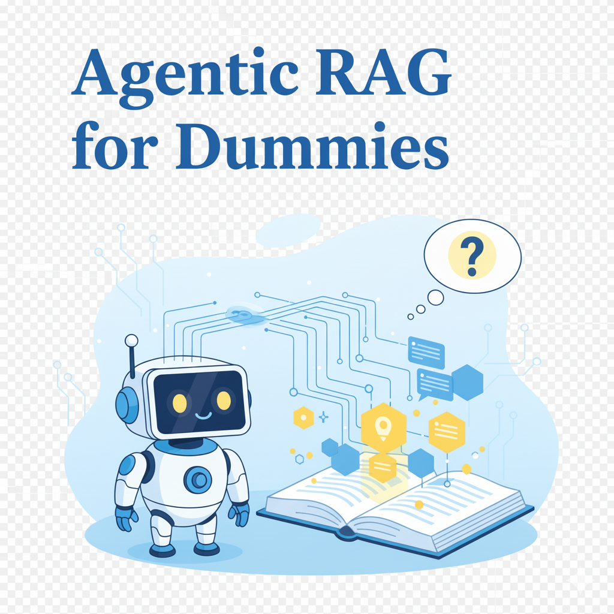
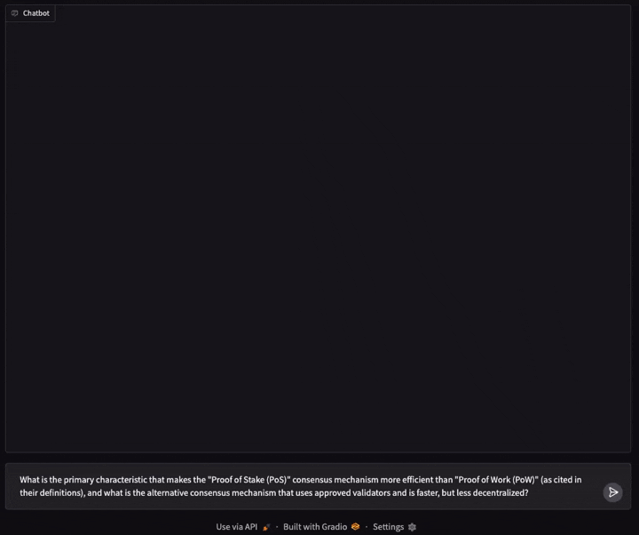

<p align="center">

</p>

<h1 align="center">Agentic RAG for Dummies</h1>

<p align="center">
  <strong>Build a production-ready Agentic RAG system with LangGraph in just a few lines of code</strong>
</p>

<p align="center">
  <a href="#overview">Overview</a> •
  <a href="#how-it-works">How It Works</a> •
  <a href="#installation">Installation</a> •
  <a href="#llm-provider-configuration">LLM Providers</a> •
  <a href="#implementation">Implementation</a> •
  <a href="#usage">Usage</a> •
  <a href="#roadmap">Roadmap</a>
</p>

<p align="center">
  <strong>Quickstart here 👉</strong> 
  <a href="https://colab.research.google.com/gist/GiovanniPasq/a9bd8e780beaea8cff07e18d09e2f4e4/agentic_rag_for_dummies.ipynb">
    
  </a>
</p>

<p align="center">
  
</p>

---

## Why This Repo?

While many RAG examples exist, most are simple pipelines that force a trade-off: use small chunks for search precision *or* large chunks for answer context. They lack the intelligence to adapt.

This repository was created to fill that gap, providing a production-ready **Agentic RAG** system that's both powerful and easy to understand. It implements a **Hierarchical (Parent/Child) indexing strategy**, letting you search small, precise chunks and *then* retrieve the full parent context for high-quality answers.

By leveraging **LangGraph**, it creates a true agent that can reason, evaluate its search results, and *decide* if it needs more context or should self-correct. It’s built to be **provider-agnostic**, allowing you to develop privately with Ollama and switch to production LLMs like Google Gemini or OpenAI by changing just one line of code.

---

## Overview

This repository demonstrates how to build an **Agentic RAG (Retrieval-Augmented Generation)** system using LangGraph with minimal code. Unlike traditional RAG systems that struggle with finding the optimal chunk size, this project implements a **Hierarchical Indexing (Parent/Child) strategy** that:

- 🔍 **Searches small, specific chunks** (Child Chunks) for high-precision retrieval
- 🧠 **Evaluates relevance** at the granular chunk level
- 📄 **Fetches larger Parent Chunks** (surrounding context) only when needed
- 🤖 **Uses an agent** (via LangGraph) to orchestrate the workflow intelligently
- 🔄 **Self-corrects** and re-queries if initial results are insufficient

This approach combines the **precision of small chunks** with the **contextual richness of large chunks**, leading to more accurate and comprehensive LLM responses.

---

## How It Works

The core innovation is the **Parent/Child document strategy**:

```
User Query → Agent → Search Child Chunks → Evaluate Relevance →
(If needed) → Retrieve Parent Chunks → Generate Answer → Return Response
```

### The Three-Stage Process

**Stage 1: Hierarchical Indexing**

Documents are split twice:
- **Parent Chunks**: Large sections based on Markdown headers (H1, H2, H3)
- **Child Chunks**: Small, fixed-size pieces (500 chars) derived from parents

**Stage 2: Dual Storage**

- **Child Chunks** → Qdrant vector database (with hybrid dense + sparse embeddings)
- **Parent Chunks** → JSON file store (retrieved by ID)

**Stage 3: Intelligent Retrieval**

1. Agent searches child chunks for precision
2. Evaluates if results are sufficient
3. Fetches parent chunks for context if needed
4. Generates answer from complete information

---

## Installation

### Prerequisites

**Step 1: Install Python dependencies**

```bash
pip install --upgrade gradio
pip install -qU langgraph langchain-huggingface
pip install -qU langchain-qdrant qdrant-client fastembed
pip install -qU langchain-text-splitters
```

**Step 2: Choose and install your LLM provider** (see next section)

---

## LLM Provider Configuration

This system is **provider-agnostic** - you can use any LLM supported by LangChain. Choose the option that best fits your needs:

### Option 1: Ollama (Local - Recommended for Development)

**Install Ollama and download the model:**

```bash
# Install Ollama from https://ollama.com
ollama pull qwen3:4b-instruct
```

**Python code:**

```python
from langchain_ollama import ChatOllama

llm = ChatOllama(
    model="qwen3:4b-instruct",
    temperature=0
)
```

---

### Option 2: Google Gemini (Cloud - Recommended for Production)

**Install the package:**

```bash
pip install -qU langchain-google-genai
```

**Python code:**

```python
import os
from langchain_google_genai import ChatGoogleGenerativeAI

# Set your Google API key
os.environ["GOOGLE_API_KEY"] = "your-api-key-here"

# Initialize the LLM with zero temperature for consistent outputs
llm = ChatGoogleGenerativeAI(
    model="gemini-2.0-flash-exp",
    temperature=0
)
```

---

### Option 3: OpenAI (Cloud)

**Install the package:**

```bash
pip install -qU langchain-openai
```

**Python code:**

```python
import os
from langchain_openai import ChatOpenAI

# Set your OpenAI API key
os.environ["OPENAI_API_KEY"] = "your-api-key-here"

llm = ChatOpenAI(
    model="gpt-4o-mini",
    temperature=0
)
```

---

### Option 4: Anthropic Claude (Cloud)

**Install the package:**

```bash
pip install -qU langchain-anthropic
```

**Python code:**

```python
import os
from langchain_anthropic import ChatAnthropic

# Set your Anthropic API key
os.environ["ANTHROPIC_API_KEY"] = "your-api-key-here"

llm = ChatAnthropic(
    model="claude-3-5-sonnet-20241022",
    temperature=0
)
```

---

### Important Notes

- **Temperature 0** is used throughout for consistent, deterministic outputs
- **All providers** work with the exact same code - only the LLM initialization changes
- **API keys** should be stored securely using environment variables or secret management services
- **Cost considerations:** Cloud providers charge per token, while Ollama is free but requires local compute resources

**💡 Recommendation:** Start with Ollama for development and testing, then switch to Google Gemini or OpenAI for production if you need faster responses or don't want to manage local infrastructure.

---

## Implementation

### Step 1: Initial Setup and Configuration

Define paths and initialize core components.

```python
import os
from pathlib import Path
from langchain_huggingface import HuggingFaceEmbeddings
from langchain_qdrant.fastembed_sparse import FastEmbedSparse
from qdrant_client import QdrantClient

# Configuration
DOCS_DIR = "docs"  # Directory containing your .md files
PARENT_STORE_PATH = "parent_store"  # Directory for parent chunk JSON files
CHILD_COLLECTION = "document_child_chunks"

# Create directories if they don't exist
os.makedirs(DOCS_DIR, exist_ok=True)
os.makedirs(PARENT_STORE_PATH, exist_ok=True)

# Initialize LLM (choose one from the previous section)
# Example with Ollama:
from langchain_ollama import ChatOllama
llm = ChatOllama(model="qwen3:4b-instruct", temperature=0)

# Or with Google Gemini:
# from langchain_google_genai import ChatGoogleGenerativeAI
# os.environ["GOOGLE_API_KEY"] = "your-api-key-here"
# llm = ChatGoogleGenerativeAI(model="gemini-2.0-flash-exp", temperature=0)

# Dense embeddings for semantic understanding
dense_embeddings = HuggingFaceEmbeddings(
    model_name="sentence-transformers/all-mpnet-base-v2"
)

# Sparse embeddings for keyword matching
sparse_embeddings = FastEmbedSparse(
    model_name="Qdrant/bm25"
)

# Qdrant client (local file-based storage)
client = QdrantClient(path="qdrant_db")
```

**Why hybrid embeddings?** Combining semantic understanding (`all-mpnet-base-v2`) with keyword matching (`bm25`) ensures we capture both meaning and specific terms.

---

### Step 2: Configure Vector Database

Set up Qdrant to store child chunks with hybrid search capabilities.

```python
from qdrant_client.http import models as qmodels
from langchain_qdrant import QdrantVectorStore
from langchain_qdrant.qdrant import RetrievalMode

# Get embedding dimension
embedding_dimension = len(dense_embeddings.embed_query("test"))

def ensure_collection(collection_name):
    """Create Qdrant collection if it doesn't exist"""
    if not client.collection_exists(collection_name):
        client.create_collection(
            collection_name=collection_name,
            vectors_config=qmodels.VectorParams(
                size=embedding_dimension,
                distance=qmodels.Distance.COSINE
            ),
            sparse_vectors_config={
                "sparse": qmodels.SparseVectorParams()
            },
        )
        print(f"✓ Created collection: {collection_name}")
    else:
        print(f"✓ Collection already exists: {collection_name}")

# Create collection
ensure_collection(CHILD_COLLECTION)

# Initialize vector store for child chunks
child_vector_store = QdrantVectorStore(
    client=client,
    collection_name=CHILD_COLLECTION,
    embedding=dense_embeddings,
    sparse_embedding=sparse_embeddings,
    retrieval_mode=RetrievalMode.HYBRID,
    sparse_vector_name="sparse"
)
```

---

### Step 3: Hierarchical Document Indexing

Process documents with the Parent/Child splitting strategy.

```python
import glob
import json
from langchain_core.documents import Document
from langchain_text_splitters import (
    MarkdownHeaderTextSplitter,
    RecursiveCharacterTextSplitter
)

def index_documents():
    """Index documents using hierarchical Parent/Child strategy"""
    print("\n" + "="*50)
    print("Starting Hierarchical Indexing")
    print("="*50 + "\n")
    
    # Parent splitter: by Markdown headers
    headers_to_split_on = [
        ("#", "H1"),
        ("##", "H2"),
        ("###", "H3")
    ]
    parent_splitter = MarkdownHeaderTextSplitter(
        headers_to_split_on=headers_to_split_on,
        strip_headers=False
    )
    
    # Child splitter: by character count
    child_splitter = RecursiveCharacterTextSplitter(
        chunk_size=500,
        chunk_overlap=100
    )
    
    all_child_chunks = []
    all_parent_pairs = []
    
    # Check if docs directory has files
    md_files = sorted(glob.glob(os.path.join(DOCS_DIR, "*.md")))
    if not md_files:
        print(f"⚠️  No .md files found in {DOCS_DIR}/")
        print("Please add your Markdown documents to continue.")
        return
    
    # Process each document
    for doc_path_str in md_files:
        doc_path = Path(doc_path_str)
        print(f"📄 Processing: {doc_path.name}")
        
        try:
            with open(doc_path, "r", encoding="utf-8") as f:
                md_text = f.read()
        except Exception as e:
            print(f"❌ Error reading {doc_path.name}: {e}")
            continue
        
        # Split into parent chunks
        parent_chunks = parent_splitter.split_text(md_text)
        
        for i, p_chunk in enumerate(parent_chunks):
            # Add metadata
            p_chunk.metadata["source"] = str(doc_path)
            parent_id = f"{doc_path.stem}_parent_{i}"
            p_chunk.metadata["parent_id"] = parent_id
            
            # Store parent reference
            all_parent_pairs.append((parent_id, p_chunk))
            
            # Split into child chunks
            child_chunks = child_splitter.split_documents([p_chunk])
            all_child_chunks.extend(child_chunks)
    
    # Save child chunks to Qdrant
    if all_child_chunks:
        print(f"\n🔍 Indexing {len(all_child_chunks)} child chunks into Qdrant...")
        try:
            child_vector_store.add_documents(all_child_chunks)
            print("✓ Child chunks indexed successfully")
        except Exception as e:
            print(f"❌ Error indexing child chunks: {e}")
            return
    else:
        print("⚠️  No child chunks to index")
        return
    
    # Save parent chunks to JSON files
    if all_parent_pairs:
        print(f"💾 Saving {len(all_parent_pairs)} parent chunks to JSON...")
        
        # Clear existing parent files
        for item in os.listdir(PARENT_STORE_PATH):
            os.remove(os.path.join(PARENT_STORE_PATH, item))
        
        # Save each parent chunk
        for parent_id, doc in all_parent_pairs:
            doc_dict = {
                "page_content": doc.page_content,
                "metadata": doc.metadata
            }
            file_path = os.path.join(PARENT_STORE_PATH, f"{parent_id}.json")
            with open(file_path, "w", encoding="utf-8") as f:
                json.dump(doc_dict, f, ensure_ascii=False, indent=2)
        
        print("✓ Parent chunks saved successfully")
    
    print("\n" + "="*50)
    print("✓ Indexing Complete!")
    print("="*50 + "\n")

# Run indexing
index_documents()
```

**Why this approach?** Small chunks provide precision for searching, while parent chunks offer complete context when needed. This eliminates the traditional RAG dilemma of choosing between precision and context.

---

### Step 4: Define Agent Tools

Create the two tools the agent will use to retrieve information.

```python
from typing import List

def search_child_chunks(query: str, k: int = 5) -> List[dict]:
    """
    Search for the top K most relevant child chunks.
    
    Args:
        query: Search query string
        k: Number of results to return
    
    Returns:
        List of dicts with content, parent_id, and source
    """
    try:
        results = child_vector_store.similarity_search(query, k=k)
        return [
            {
                "content": doc.page_content,
                "parent_id": doc.metadata.get("parent_id", ""),
                "source": doc.metadata.get("source", "")
            }
            for doc in results
        ]
    except Exception as e:
        print(f"Error searching child chunks: {e}")
        return []

def retrieve_parent_chunks(parent_ids: List[str]) -> List[dict]:
    """
    Retrieve full parent chunks by their IDs.
    
    Args:
        parent_ids: List of parent chunk IDs to retrieve
    
    Returns:
        List of dicts with content, parent_id, and metadata
    """
    unique_ids = sorted(list(set(parent_ids)))
    results = []
    
    for parent_id in unique_ids:
        file_path = os.path.join(PARENT_STORE_PATH, f"{parent_id}.json")
        if os.path.exists(file_path):
            try:
                with open(file_path, "r", encoding="utf-8") as f:
                    doc_dict = json.load(f)
                    results.append({
                        "content": doc_dict["page_content"],
                        "parent_id": parent_id,
                        "metadata": doc_dict["metadata"]
                    })
            except Exception as e:
                print(f"Error loading parent chunk {parent_id}: {e}")
    
    return results

# Bind tools to LLM
llm_with_tools = llm.bind_tools([search_child_chunks, retrieve_parent_chunks])
```

**Why separate tools?** This gives the agent fine-grained control. It can search first, evaluate results, then decide whether to fetch more context.

---

### Step 5: Define Agent System Prompt

Create the prompt that guides the agent's reasoning process.

```python
from langchain_core.messages import SystemMessage

SYSTEM_PROMPT = """You are an intelligent assistant specialized in answering questions using documents.

Follow this precise workflow:

**1. Analyze the Question**
- Understand what the user is asking
- Identify main topics
- If complex, split into focused subqueries
- Process each subquery through steps 2-7

**2. Retrieve Child Chunks**
- Use `search_child_chunks` to find relevant small chunks
- Choose appropriate K value (default: 5)

**3. Evaluate Child Chunks**
- Read retrieved content carefully
- Determine relevance to the question
- Identify `parent_id`s of most relevant chunks
- If chunks contain ALL needed information, skip to step 6

**4. Assess Need for Context**
- If chunks are fragmented, unclear, or incomplete
- If they only partially answer the question
- Then retrieve parent chunks

**5. Retrieve Parent Chunks (if needed)**
- Use `retrieve_parent_chunks` with unique `parent_id`s
- Read parent chunks for full context

**6. Generate Answer**
- Base answer exclusively on retrieved information
- Combine subquery answers if applicable
- Explain concepts clearly
- Cite source files (without extension) using metadata
- Example: "This information comes from '[filename]'"

**7. Verify and Iterate**
- If initial search found nothing relevant: rephrase query and retry
- If parent chunks insufficient: restart from step 1
- Maximum 3 attempts per question/subquery
- After 3 attempts, ask user to rephrase

**Critical Rules:**
- Follow steps 1-7 for every question/subquery
- Answer only from retrieved chunks
- Never fabricate information
- Always cite sources
"""

system_message = SystemMessage(content=SYSTEM_PROMPT)
```

**Why this structure?** The explicit workflow forces the agent to evaluate small chunks before fetching larger ones, preventing unnecessary context bloat and keeping responses focused.

---

### Step 6: Build the LangGraph Agent

Create the agent's execution graph with proper state management.

```python
from langgraph.graph import MessagesState, START, StateGraph
from langgraph.prebuilt import ToolNode, tools_condition
from langchain_core.messages import HumanMessage

def agent_node(state: MessagesState):
    """
    Agent decision-making node.
    Decides which tool to call or generates final response.
    """
    messages = [system_message] + state["messages"]
    response = llm_with_tools.invoke(messages)
    return {"messages": [response]}

# Build the execution graph
graph_builder = StateGraph(MessagesState)

# Add nodes
graph_builder.add_node("agent", agent_node)
graph_builder.add_node(
    "tools",
    ToolNode([search_child_chunks, retrieve_parent_chunks])
)

# Define edges
graph_builder.add_edge(START, "agent")
graph_builder.add_conditional_edges(
    "agent",
    tools_condition,  # Routes to tools or END
)
graph_builder.add_edge("tools", "agent")

# Compile the graph
agent_graph = graph_builder.compile()

print("✓ Agent graph compiled successfully")
```

**Flow explanation:**
1. Query enters at START → agent
2. Agent decides: call tool or generate answer
3. If tool needed → tools node executes → returns to agent
4. Agent evaluates → repeats or generates final answer
5. Loop continues until answer is complete

---

### Step 7: Create Chat Interface

Build a simple Gradio interface for interaction.

```python
import gradio as gr

def chat_with_agent(message, history):
    """
    Process user message through the agent graph.
    
    Args:
        message: User's question
        history: Chat history (unused in current implementation)
    
    Returns:
        Agent's response as string
    """
    try:
        result = agent_graph.invoke({
            "messages": [HumanMessage(content=message)]
        })
        return result["messages"][-1].content
    except Exception as e:
        return f"❌ Error: {str(e)}\n\nPlease try rephrasing your question."

# Create and launch interface
demo = gr.ChatInterface(
    fn=chat_with_agent,
    title="🤖 Agentic RAG Assistant",
    description="Ask questions about your documents. The agent will intelligently retrieve and combine information."
)

print("\n🚀 Launching chat interface...")
demo.launch(share=False)
```

**You're done!** You now have a fully functional Agentic RAG system.

---

## Usage

You have two ways to run this project. Choose the one that fits your needs.

### Option 1: Quickstart Notebook (Recommended for testing)

The easiest way to get started is by using the all-in-one **Jupyter/Colab Notebook**.

1. Click the **Open in Colab** badge at the top of this README.
2. Once in Colab, create a `docs/` folder in the file browser.
3. Upload your own `.md` files to the new `docs/` folder.
4. Run all the cells in the notebook from top to bottom. The chat interface will appear at the end.

### Option 2: Full Python Project (Recommended for development)

#### 1. Install Dependencies
First, ensure you have all the required packages. It's highly recommended to use a virtual environment.

```bash
# Create a virtual environment (optional but recommended)
python -m venv venv

# Activate it (choose one):
# On macOS/Linux:
source venv/bin/activate
# On Windows:
.\venv\Scripts\activate

# Install required packages from the file
pip install -r requirements.txt
```

#### 2. Add Your Documents
Place your `.md` files into the `docs/` directory. Example files are already included so you can run the project immediately.

#### 3. Index Your Documents
Before running the app, you must process and index your documents. Run the indexing script from your terminal:

```bash
python indexing.py
```

This will read all files from `docs/`, split them, and populate the Qdrant database and the `parent_store/`.

#### 4. Run the Application
Once indexing is complete, start the Gradio web interface:

```bash
python app.py
```

#### 5. Ask Questions

Open the local URL (e.g., ```http://127.0.0.1:7860```) printed in your terminal to start chatting.


### Converting PDFs to Markdown

Need to convert PDFs? Use this companion notebook:

📘 **[PDF to Markdown Converter](https://colab.research.google.com/gist/GiovanniPasq/fdea06b09b396fe626156e4f38b6e091/pdf_to_md.ipynb)**

---

## Roadmap

### 🔜 Coming Soon

**💬 Conversation Memory**

Maintain context across multiple questions for natural dialogue.

```
User: "How do I install SQL?"
Agent: [Installation steps]

User: "How do I update it?"
Agent: [Understands "it" = SQL, provides update steps]
```

**🔄 Human-in-the-Loop Feedback**

Iterative improvement through user feedback.

1. Agent generates answer
2. User rates: helpful or not
3. If not helpful → agent retries with different strategy
4. Learn from feedback to improve over time

---

## License

MIT License - Feel free to use this for learning and building your own projects!

---

## Contributing

Contributions are welcome! Open an issue or submit a pull request.
